# `kdenlive`の`Effects`の例
## はじめに
`kdenlive`はたいへん高機能なゆえに学習曲線の問題があります。
また慣れてくると「決まったエフェクトしか使わない」という問題が生じます。
ここでは一度腰を据えて、全エフェクトの例を記載し、整理したいと思います。
なおエフェクトにはオーディオと映像がありますが、この記事では映像のみを扱います。


## 環境
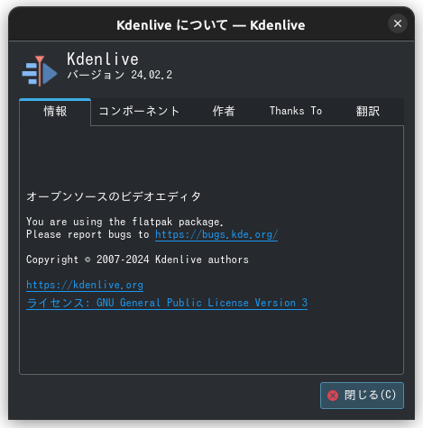
```bash
# kdenlive
# 24.02.2 (Flatpak版)

$ inxi -Sxxx --filter
System:
  Kernel: 6.5.0-35-generic x86_64 bits: 64 compiler: N/A Desktop: Unity
    wm: gnome-shell dm: GDM3 42.0 Distro: Ubuntu 22.04.4 LTS (Jammy Jellyfish)
```

## 参考
[Kdenlive Manual](https://docs.kdenlive.org/en/index.html)
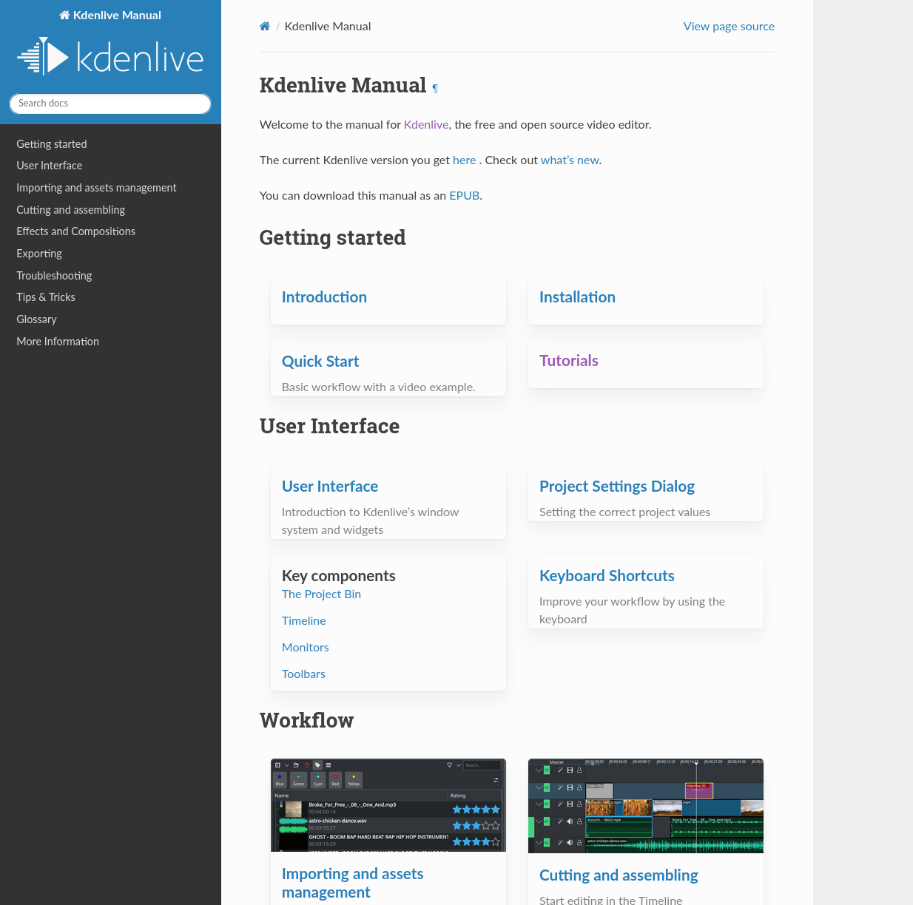
[Effects and Compositions](https://docs.kdenlive.org/en/effects_and_compositions.html)

## カテゴリー
- Grain and Noise
  - ノイズ加算
    - [Dust](https://docs.kdenlive.org/en/effects_and_compositions/video_effects/grain_and_noise/dust.html)
    - 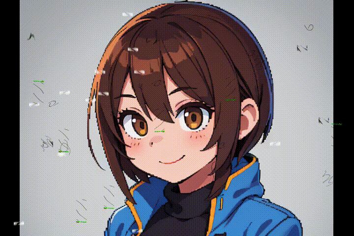
    - [Median](https://docs.kdenlive.org/en/effects_and_compositions/video_effects/grain_and_noise/median.html)
    - 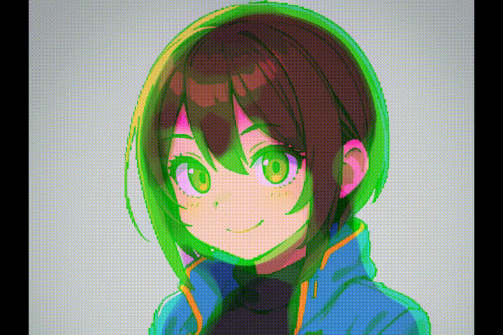
    - [Video Noise Generator](https://docs.kdenlive.org/en/effects_and_compositions/video_effects/grain_and_noise/video_noise_generator.html)
    - 
  - デノイズ
    - 3D FFT Denoiser
    - Chroma Noise Reduction
    - Denoiser
    - [Gradfun](https://docs.kdenlive.org/en/effects_and_compositions/video_effects/grain_and_noise/gradfun.html)
    - 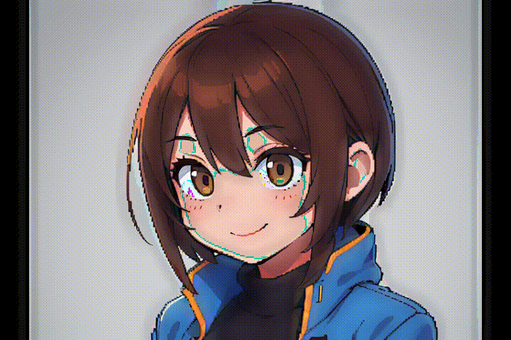
- Image adjustment
  - Color Matrix
  - [Color Space](https://docs.kdenlive.org/en/effects_and_compositions/video_effects/image_adjustment/color_space.html)
    - 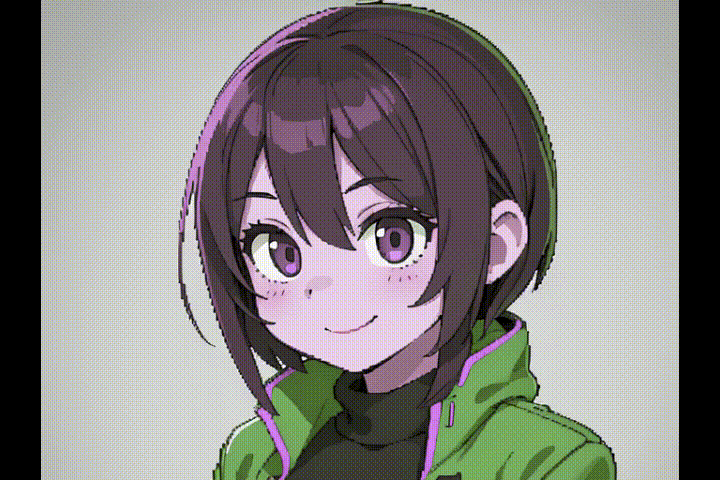
  - [Deband](https://docs.kdenlive.org/en/effects_and_compositions/video_effects/image_adjustment/deband.html)
    - 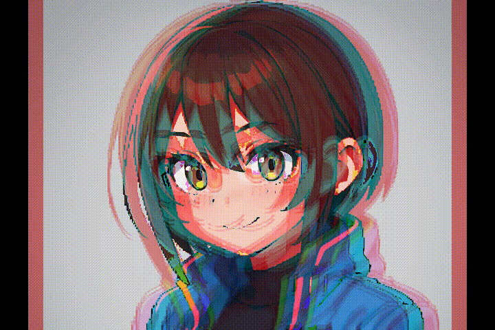
  - Dilation
  - EPX Scaler
  - Erosion
  - Hq*x Interpolator
  - Interlace field order
  - Interleave - Deinterleave
  - Kernel Deinterlacer
  - Motion compensation Deinterlacer
  - Phase
  - Set Range
  - Super2xsai
  - xBR Interpolator
- Transform, Distort and Perspective
  - [Corners](https://docs.kdenlive.org/en/effects_and_compositions/video_effects/transform_distort_perspective/corners.html)
    - 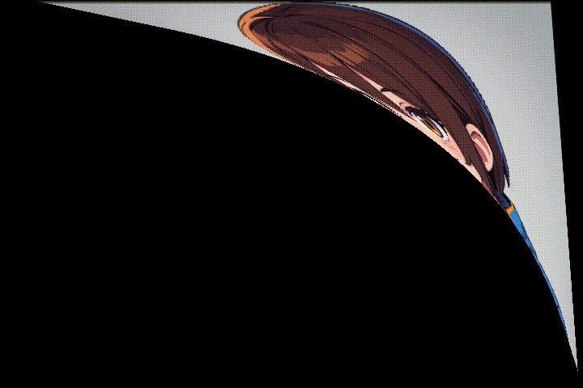
  - [Crop by padding](https://docs.kdenlive.org/en/effects_and_compositions/video_effects/transform_distort_perspective/crop_padding.html)
    - 
  - [Crop Scale and Tilt](https://docs.kdenlive.org/en/effects_and_compositions/video_effects/transform_distort_perspective/crop_scale_tilt.html)
    - 
  - [Defish](https://docs.kdenlive.org/en/effects_and_compositions/video_effects/transform_distort_perspective/defish.html)
    - 
  - [Distort](https://docs.kdenlive.org/en/effects_and_compositions/video_effects/transform_distort_perspective/distort.html)
    - 
  - [Edge Crop](https://docs.kdenlive.org/en/effects_and_compositions/video_effects/transform_distort_perspective/edge_crop.html)
    - 
  - [Elastic scale filter](https://docs.kdenlive.org/en/effects_and_compositions/video_effects/transform_distort_perspective/elastic_scale_filter.html)
    - 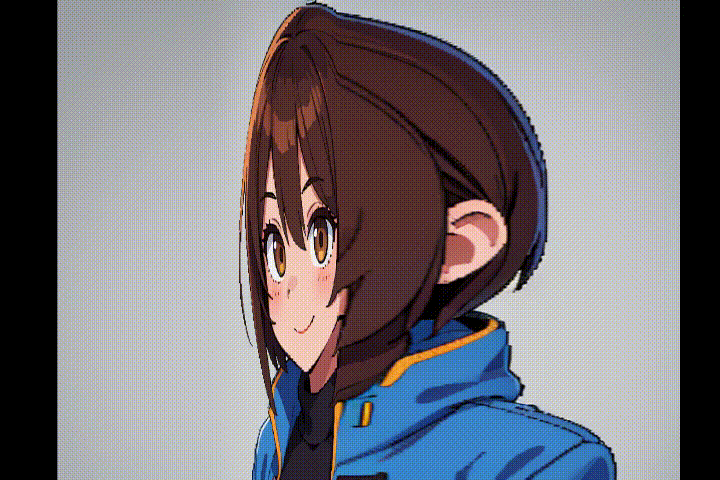
  - [Fill borders](https://docs.kdenlive.org/en/effects_and_compositions/video_effects/transform_distort_perspective/fill_borders.html)
    - 
  - [Flip Horizontally](https://docs.kdenlive.org/en/effects_and_compositions/video_effects/transform_distort_perspective/flip_horizontally.html)
    - 
  - Flip Vertically
  - [Flippo](https://docs.kdenlive.org/en/effects_and_compositions/video_effects/transform_distort_perspective/flippo.html)
    - 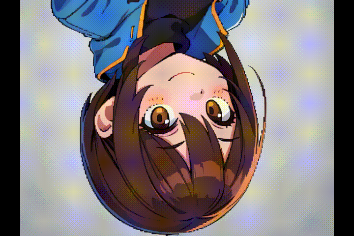
  - [Lens correction](https://docs.kdenlive.org/en/effects_and_compositions/video_effects/transform_distort_perspective/lens_correction.html)
    - 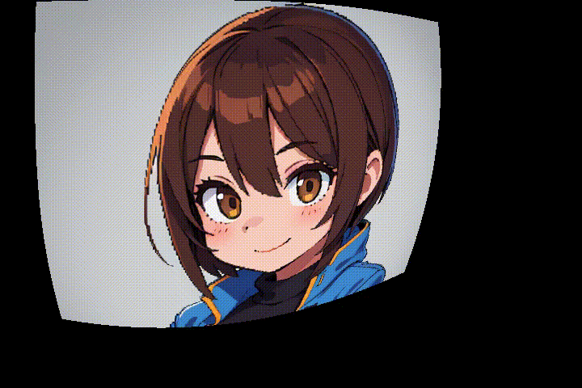
  - [Lens correction(keyframable)](https://docs.kdenlive.org/en/effects_and_compositions/video_effects/transform_distort_perspective/lens_correction_keyframe.html)
    - .gif)
  - [LetterB0xed](https://docs.kdenlive.org/en/effects_and_compositions/video_effects/transform_distort_perspective/letterb0xed.html)
    - 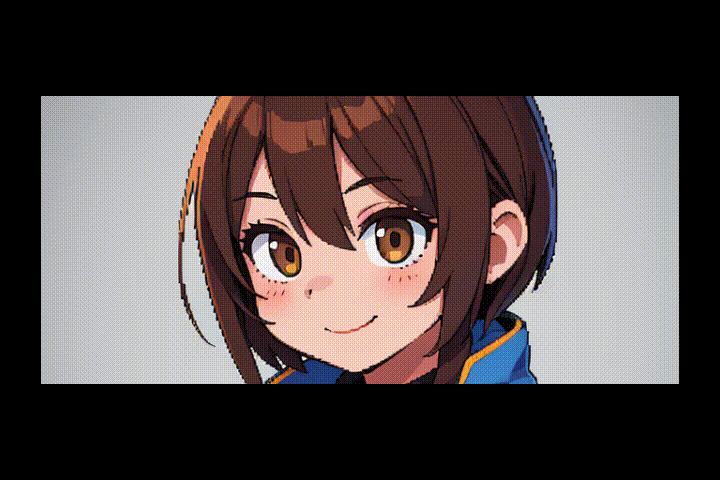
  - [Mirror](https://docs.kdenlive.org/en/effects_and_compositions/video_effects/transform_distort_perspective/mirror.html)
    - 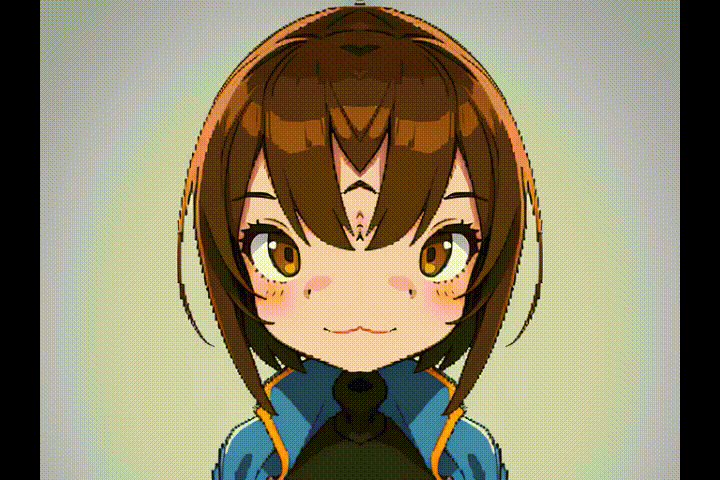
  - [nosync0r(Broken TV)](https://docs.kdenlive.org/en/effects_and_compositions/video_effects/transform_distort_perspective/nosync0r.html)
    - 
  - [Pillar Echo](https://docs.kdenlive.org/en/effects_and_compositions/video_effects/transform_distort_perspective/pillar_echo.html)
    - 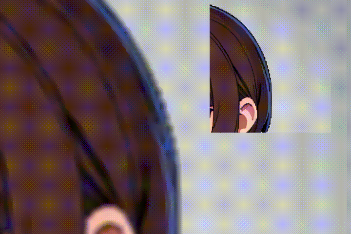
  - [Position and Zoom](https://docs.kdenlive.org/en/effects_and_compositions/video_effects/transform_distort_perspective/position_and_zoom.html)
    - 
  - [Rotate(keyframable)](https://docs.kdenlive.org/en/effects_and_compositions/video_effects/transform_distort_perspective/rotate_keyframable.html)
    - .gif)
  - [Rotate and Shear](https://docs.kdenlive.org/en/effects_and_compositions/video_effects/transform_distort_perspective/rotate_and_shear.html)
    - 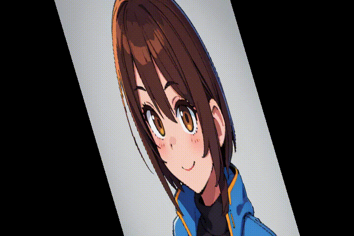
  - [Scroll](https://docs.kdenlive.org/en/effects_and_compositions/video_effects/transform_distort_perspective/scroll.html)
    - 
  - [Shear](https://docs.kdenlive.org/en/effects_and_compositions/video_effects/transform_distort_perspective/shear.html)
    - 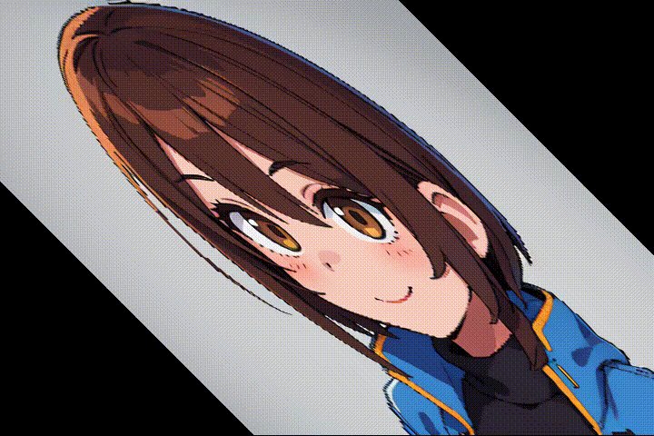
  - [Transform](https://docs.kdenlive.org/en/effects_and_compositions/video_effects/transform_distort_perspective/transform.html)
    - 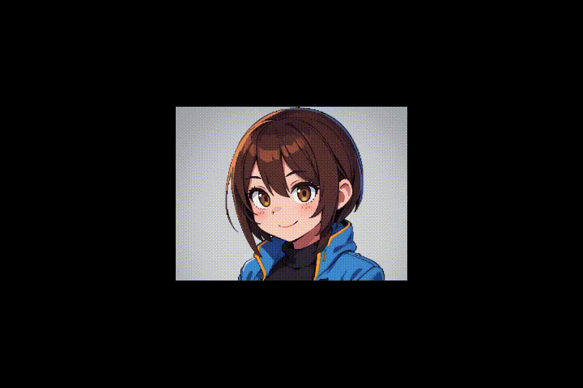
  - [Transpose](https://docs.kdenlive.org/en/effects_and_compositions/video_effects/transform_distort_perspective/transpose.html)
    - 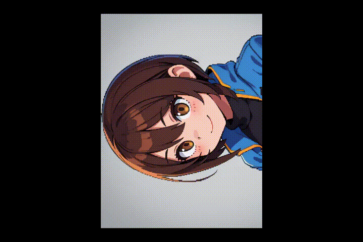
  - [Zoom Pan](https://docs.kdenlive.org/en/effects_and_compositions/video_effects/transform_distort_perspective/zoom_pan.html)
    - 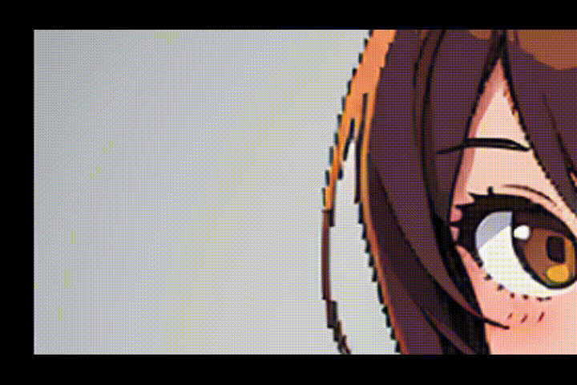
- VR360と3D
  - [Stereoscopic 3D](https://docs.kdenlive.org/en/effects_and_compositions/video_effects/vr360_and_3d/stereoscopic_3d.html)
    - 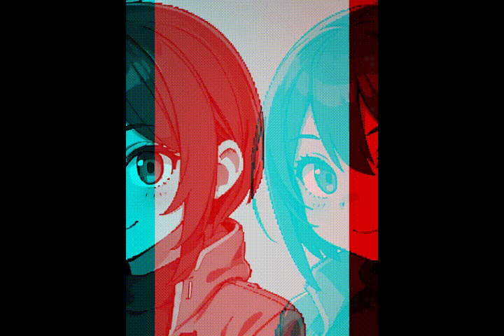
  - [VR360 Equirectangular Mask](https://docs.kdenlive.org/en/effects_and_compositions/video_effects/vr360_and_3d/vr360_equi_mask.html)
    - 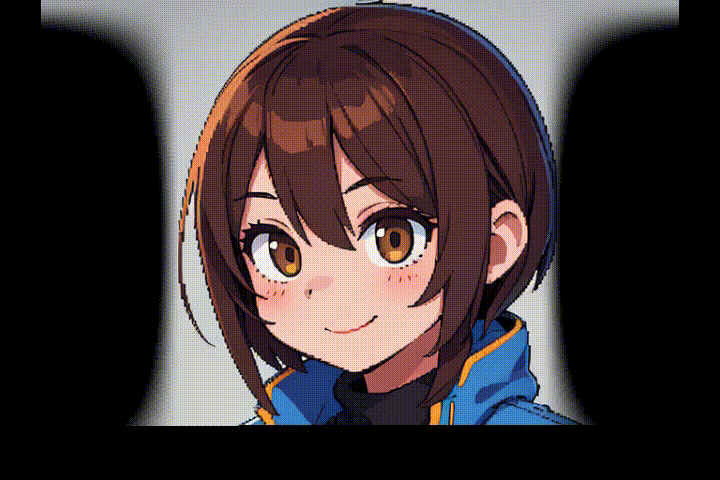
  - [VR360 Equirectangular to Rectilinear](https://docs.kdenlive.org/en/effects_and_compositions/video_effects/vr360_and_3d/vr360_equi2rect.html)
    - 
  - [VR360 Equirectangular to Stereo](https://docs.kdenlive.org/en/effects_and_compositions/video_effects/vr360_and_3d/vr360_equi2stereo.html)
    - 
  - [VR360 Hemispherical to Equirectangular](https://docs.kdenlive.org/en/effects_and_compositions/video_effects/vr360_and_3d/vr360_hemi2equi.html)
    - 
  - [VR360 Rectilinear to Equirectangular](https://docs.kdenlive.org/en/effects_and_compositions/video_effects/vr360_and_3d/vr360_rect2equi.html)
    - 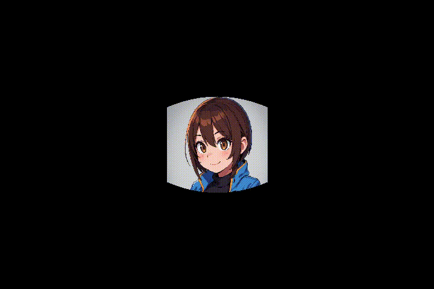
  - [VR360 Stabilize](https://docs.kdenlive.org/en/effects_and_compositions/video_effects/vr360_and_3d/vr360_stabilize.html)
    - 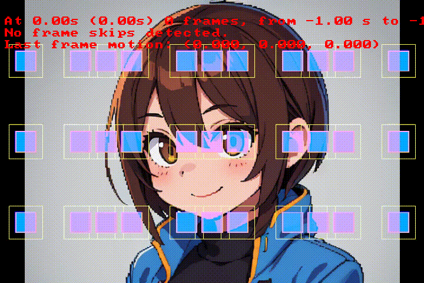
  - [VR360 Transform](https://docs.kdenlive.org/en/effects_and_compositions/video_effects/vr360_and_3d/vr360_transform.html)
    - 
- アルファ、マスク、キー
  - [Alpha gradient](https://docs.kdenlive.org/en/effects_and_compositions/video_effects/alpha_mask_keying/alpha_gradient.html)
    - 
  - [Alpha operations](https://docs.kdenlive.org/en/effects_and_compositions/video_effects/alpha_mask_keying/alpha_operations.html)
    - 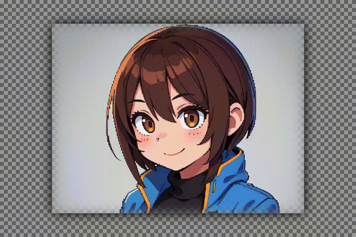
  - [Alpha shapes](https://docs.kdenlive.org/en/effects_and_compositions/video_effects/alpha_mask_keying/alpha_shapes.html)
    - 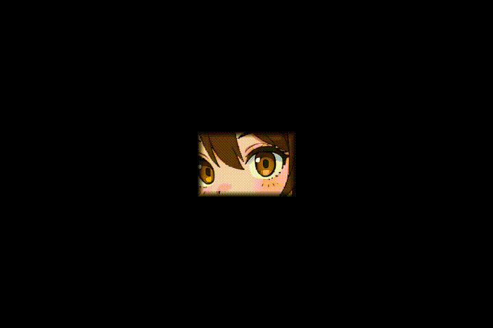
  - [Alpha shapes(Mask)](https://docs.kdenlive.org/en/effects_and_compositions/video_effects/alpha_mask_keying/alpha_shapes_mask.html)
    - .gif)
  - [Alpha strobing](https://docs.kdenlive.org/en/effects_and_compositions/video_effects/alpha_mask_keying/alpha_strobing.html)
    - 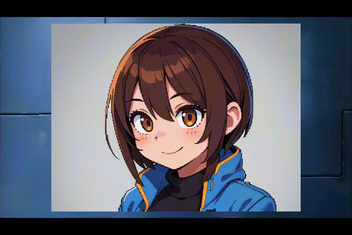
  - [Bluescreen0r](https://docs.kdenlive.org/en/effects_and_compositions/video_effects/alpha_mask_keying/bluescreen0r.html)
    - 
  - [Chroma Key: Advanced(Color Selection)](https://docs.kdenlive.org/en/effects_and_compositions/video_effects/alpha_mask_keying/chroma_key_advanced.html)
    - .gif)
  - [Chroma Key: Basic](https://docs.kdenlive.org/en/effects_and_compositions/video_effects/alpha_mask_keying/chroma_key.html)
    - 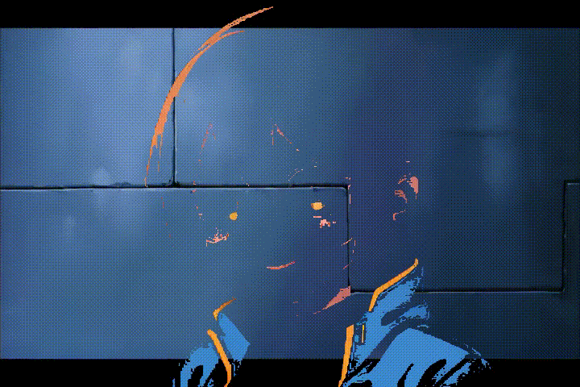
  - [Despill](https://docs.kdenlive.org/en/effects_and_compositions/video_effects/alpha_mask_keying/despill.html)
    - 
- スタイル
- その他
- ぼかしとシャープネス
- マスター上
- モーション
- ユーティリティ
- 色と画像の補正
- 生成
- 非推奨


